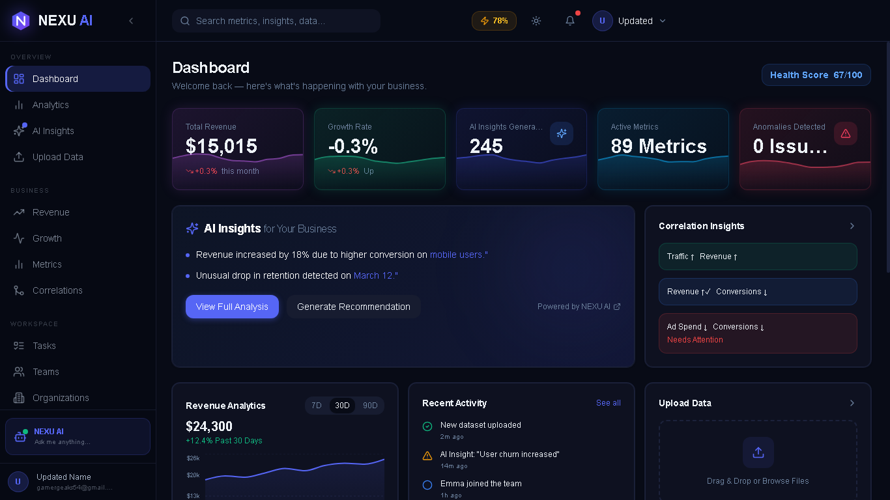
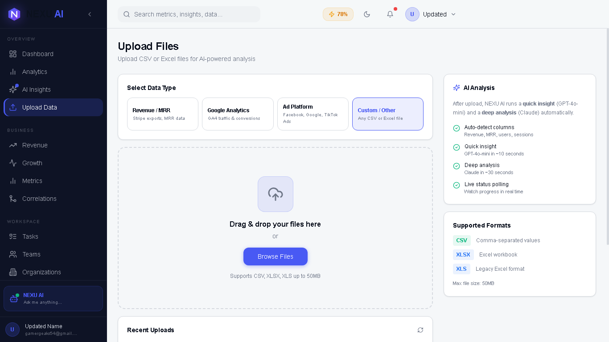
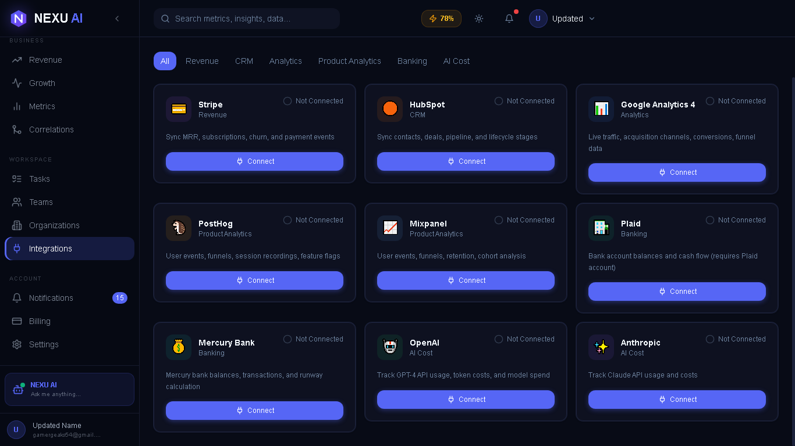
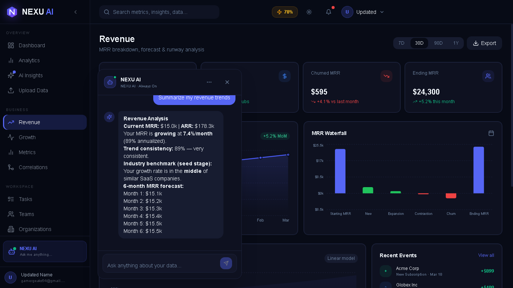

# 🧠 NexusAI SaaS Starter

> Turn your data into AI-powered SaaS products with built-in multi-tenant architecture and analytics.

---
## 🌐 Live Demo

👉 **[🚀 View Live Demo](https://complete-saa-s-intelligence-platfor.vercel.app)**

> Demo account:
> Email: gamergeaks5@gmail.com  
> Password: WAsike54

## 🚀 What is this?

Building an AI SaaS product from scratch is slow, complex, and repetitive.

**NexusAI SaaS Starter** gives you a ready-to-use foundation to launch your own AI-powered SaaS with:

* Multi-tenant architecture (teams & organizations)
* Data upload (CSV/XLSX)
* AI-powered insights
* Analytics dashboard
* Modern full-stack setup (FastAPI + Next.js)

## 📸 Preview

### Dashboard


### Analytics


### Data Upload


### Integrations


### NexusAI


---

## ⚡ Why this is different

Most SaaS starters give you:

* Auth
* Basic CRUD
* Empty dashboards

👉 **NexusAI gives you a working intelligence system**

You’re not starting from zero — you’re starting from a **real product base**.

---
| **🆓 Free (GitHub)**                     | **💎 Pro (Gumroad — Locked)**                                                                    |
| ---------------------------------------- | ------------------------------------------------------------------------------------------------ |
| ## 🛠 Backend Included                   | ## 🧠 Backend — Pro Only                                                                         |
| Auth — register, login, JWT, `/me`       | AI Insights router (benchmarks, anomalies, what-if, segmentation)                                |
| Users — profile, password update         | Correlations router (ad spend ↔ revenue, Pearson engine)                                         |
| Dashboard — summary endpoint             | Payments & Billing router (Stripe webhooks, subscriptions)                                       |
| Metrics — snapshots, trends              | Integrations router (Stripe, HubSpot, GA4, PostHog, Mixpanel, Plaid, Mercury, OpenAI, Anthropic) |
| Revenue — summary + basic forecast       | Admin router (audit logs, superuser analytics)                                                   |
| Growth — summary endpoint                | Uploads router (CSV/XLSX ingestion + AI parsing)                                                 |
| Analytics — create & list reports        | AI Usage router (cost tracking, token logs)                                                      |
| Notifications — list, mark read          | Recommendations router (AI-generated action items)                                               |
| Support — ticket creation                | Tasks router (full task management)                                                              |
| Health check endpoint                    | Team advanced — roles, audit trail, performance metrics                                          |
| Organizations — basic CRUD               | Celery + Redis task queue (forecast tasks, cleanup, metric tasks)                                |
| Team — list members, 1 seat invite       |                                                                                                  |
|                                          |                                                                                                  |
| ## 🎨 Frontend Pages                     | ## 🎯 Frontend — Pro Only                                                                        |
| Login / Register / Invite accept         | AI Insights page (benchmarks, anomalies, health score)                                           |
| Dashboard page (live data)               | Correlations page (ad campaign intelligence)                                                     |
| Analytics page (basic)                   | Billing page (plans, invoices, usage)                                                            |
| Revenue page (summary)                   | Upload page (CSV/XLSX drag-drop + AI analysis)                                                   |
| Growth page                              | Integrations page (9 providers)                                                                  |
| Metrics page                             | Tasks page (full Kanban/list)                                                                    |
| Notifications page                       | Team page (invite, roles, audit)                                                                 |
| Settings page                            | Organizations page                                                                               |
| Sidebar, Topbar, Mobile nav              | NEXU AI Chat (full, with history)                                                                |
|                                          | AI Assistant page                                                                                |
|                                          |                                                                                                  |
| ## 🤖 AI Capabilities                    | ## 🧠 AI Services — Pro Only                                                                     |
| Built-in rule engine (no API key needed) | `builtin_engine.py` — full 7-module intelligence engine                                          |
| 5 quick prompts, no history              | `insight_service.py` — AI insight generation                                                     |
| Basic revenue + churn answers only       | `web_intelligence.py` — DuckDuckGo / HN / Reddit enrichment                                      |
|                                          | OpenAI + Anthropic fallback routing                                                              |
|                                          | `anomaly_service.py` — z-score detection, alert rules                                            |
|                                          | `whatif_service.py` — 10 scenario types, 12-month projection                                     |
|                                          | `benchmarks.py` — SaaS percentile database                                                       |
|                                          | `correlation_service.py` — Pearson + campaign scoring                                            |
|                                          | `recommendation_service.py`                                                                      |
|                                          |                                                                                                  |
| ## ⚙️ Infrastructure                     | ## 📊 Models — Pro Only                                                                          |
| FastAPI + SQLAlchemy + Alembic           | Payment, Plan, Subscription                                                                      |
| Next.js 15 App Router + TypeScript       | PaymentMethod, PaymentTransaction                                                                |
| Docker + Docker Compose                  | AIUsageLog                                                                                       |
| PostgreSQL (Neon-compatible)             | AdCampaignMetric, UploadedRow, DataUpload                                                        |
| `.env.example`, `docs/`, screenshots     | Recommendation                                                                                   |
|                                          | AuditLog, PerformanceMetric                                                                      |
|                                          | AlertRule, AlertEvent                                                                            |

---

## 🔥 Features

* 🧠 AI-powered data insights
* 📊 Built-in analytics dashboard
* 🏢 Multi-tenant SaaS architecture
* 📁 CSV & XLSX data uploads
* ⚡ FastAPI backend
* 🌐 Next.js frontend
* 🐳 Docker-ready setup
* 🔐 Scalable structure for production

---

## 🛠 Tech Stack

* **Backend:** FastAPI
* **Frontend:** Next.js
* **Database:** PostgreSQL (via SQLAlchemy & Alembic)
* **AI Integration:** OpenAI / API-ready
* **Deployment:** Docker & Docker Compose

---

## 📁 Project Structure
backend/ # FastAPI backend
frontend/ # Next.js frontend
docker/ # Docker configs

## 👤 Who this is for

- Developers building AI SaaS products  
- Startups validating ideas fast  
- Freelancers building client dashboards  
- Indie hackers launching MVPs

## 🎁 What you get

- Production-ready SaaS architecture  
- AI-powered data processing system  
- Scalable backend + modern frontend  
- Time saved (weeks of development)  

## ⚡ Quick Start

Clone the repository:

```bash
git clone https://github.com/RASH54/nexusai-saas-starter.git
```

Navigate into the project:

```bash
cd nexusai-saas-starter
```

Run the application:

```bash
docker-compose up --build
```

## ⭐ Support

If you find this useful, consider giving it a star ⭐  
It helps others discover the project.
